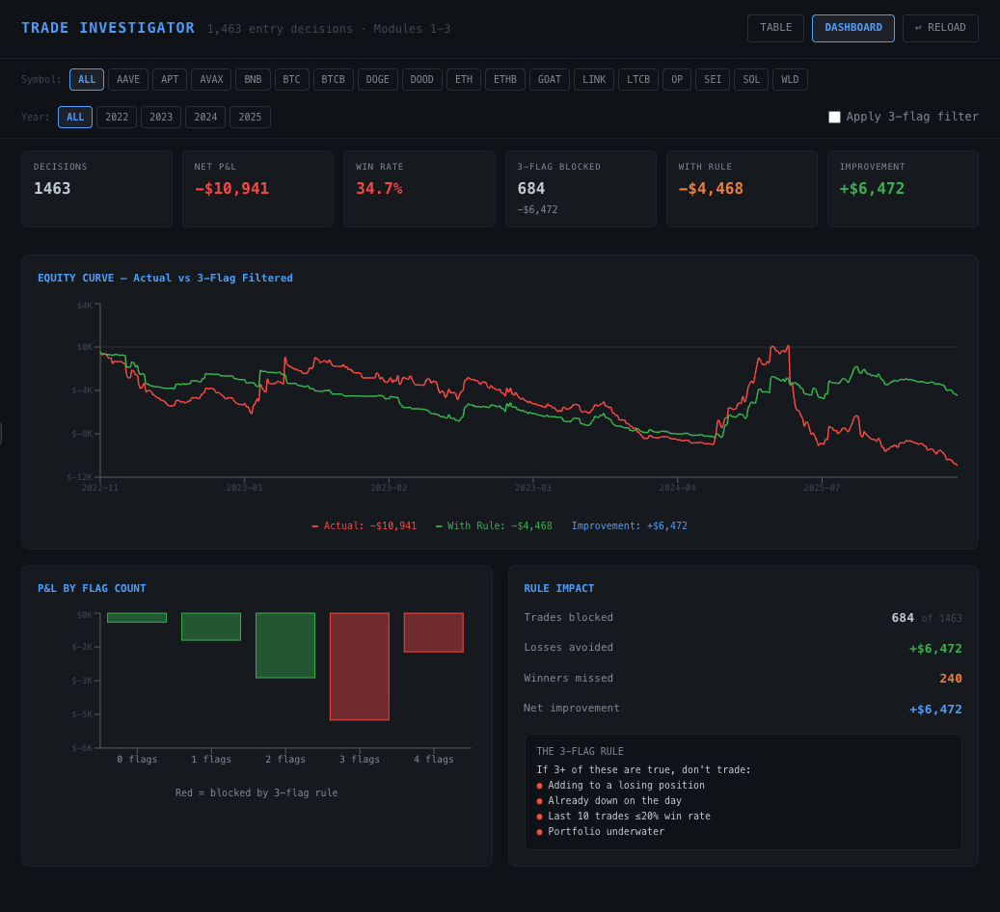

# Trade Investigator

**Systematic post-trade analysis framework for decomposing trading decisions into behavioral risk factors.**

Built to answer a specific question: across thousands of trades over multiple years, what separates the entries that work from the ones that don't — and can that separation be reduced to a rule?



---

## What This Does

Trade Investigator takes raw exchange fill data (timestamps, prices, quantities, fees) and builds a complete analytical pipeline:

1. **FIFO Matching Engine** — Converts ~10,000 raw fills into 6,232 properly matched trades using a first-in-first-out queue with proportional consumption and pro-rated fee allocation. Validates results against authoritative top-down totals (two-level fee accounting).

2. **Behavioral Decomposition** — Collapses matched trades into 1,463 *entry decisions* (the moment a position was opened), then reconstructs the full context around each decision: portfolio state, daily P&L, recent win rate, concurrent positions, and exit classification.

3. **Risk Flag Analysis** — Tests whether specific combinations of behavioral conditions at entry time predict poor outcomes. The 3-flag filter (adding to loser × red day × cold streak) back-tested to a +$6,472 P&L improvement across all decisions.

---

## Key Findings

These findings were derived from the complete 4-year private dataset (6,232 trades). The included 100-trade sample demonstrates how the pipeline works — FIFO matching, fee pro-rating, flag computation — but is not large enough to reproduce these aggregate patterns. Full dataset walkthroughs are available on request.

### Holding-Period Regime

The single largest performance driver was not signal quality — it was whether the holding period was long enough for the expected move to overcome the fee structure.

| Holding Period | Trades | Net P&L | Avg P&L | Status |
|---|---|---|---|---|
| < 30 min | 1,685 | −$10,614 | −$6.30 | Bleed |
| 30m – 2h | 2,489 | −$8,733 | −$3.51 | Bleed |
| 2 – 8h | 2,336 | +$1,452 | +$0.62 | Edge |
| 8 – 24h | 1,671 | −$168 | −$0.10 | Breakeven |
| 1 – 7 days | 1,255 | +$2,916 | +$2.32 | Edge |
| > 7 days | 218 | +$4,231 | +$19.41 | Best edge |

Sub-2h trades: 4,174 trades, **−$19,347**. Trades held 2h+: 5,480 trades, **+$8,431**. Same instruments, same directional signals — the cost structure sets a floor on the minimum viable timeframe.

### Fee Structure Discovery

Two-level reconciliation surfaced $8,589 in total fees — **8.2× larger than the apparent P&L gap** visible from naive analysis. This finding only emerged because the engine computes fees both bottom-up (per matched trade, pro-rated) and top-down (authoritative sum from raw data), then compares the two for validation.

### 3-Flag Behavioral Filter

Across 1,463 entry decisions, three behavioral conditions at entry time were tested as risk flags:

- **Adding to loser** — entering the same direction on a symbol where the existing position is underwater
- **Red day** — daily P&L was already negative before this entry
- **Cold streak** — last 10 closed trades had ≤20% win rate

When 3+ flags were active simultaneously, those entries produced −$6,472 in aggregate losses. Blocking them improves net P&L by that amount — though the filter also blocks some winners (240 winning trades missed vs. 444 losing trades avoided).

---

## Architecture

```
trade-investigator/
├── engine/
│   ├── fifo_engine.py       ← FIFO matching with proportional queue consumption
│   ├── investigator.py      ← Entry-decision decomposition & behavioral flags
│   ├── analysis.py          ← Holding-period, time-of-day, and summary analytics
│   └── example_analysis.py  ← Runnable: loads sample data → full pipeline → results
├── explorer/
│   └── trade_explorer.jsx   ← Interactive React visualization (see screenshots)
├── data/
│   └── sample_trades.csv    ← 100 anonymized trades for demonstration
├── screenshots/
│   ├── dashboard.png
│   ├── detail_panel.png
│   └── equity_curve.png
└── requirements.txt
```

### FIFO Matching Engine (`fifo_engine.py`)

The core problem: raw exchange data gives you individual fills (buys and sells), but not which buy matched which sell to form a trade. When multiple entries are open on the same instrument at different prices, closing fills need to be matched against the correct entry to calculate accurate P&L.

The engine maintains a per-symbol queue. When a closing fill arrives, it consumes from the front of the queue (first-in-first-out). If a single entry is partially closed, the remaining quantity stays in the queue with its proportional share of the original entry fee. This produces accurate per-trade P&L with properly allocated fees.

**Two-level fee accounting** validates the matching:
- **Level 1 (bottom-up):** Sum of all individually matched trade P&Ls with pro-rated fees
- **Level 2 (top-down):** Authoritative total computed directly from raw data before any matching

These two numbers should converge. The scale factor between them is the reconciliation check — if it drifts significantly from 1.0, the matching logic has a problem.

### Behavioral Decomposition (`investigator.py`)

Raw FIFO output gives you 6,232 matched trades. But many of those trades are partial closes of the same entry decision. The investigator collapses matched trades into 1,463 *entry decisions* — the moment you opened a position — and reconstructs three modules of context:

- **Pre-trade context:** Portfolio P&L at entry, daily P&L before this trade, recent win rate (last 10 trades), whether this was a fresh entry or an add to an existing position
- **Concurrent positions:** What else was open? Was a hedge active? How many layers on the same symbol?
- **Exit classification:** Was the exit orderly, a stop-out, panic-driven, or dragged out?

### Interactive Explorer (`explorer/trade_explorer.jsx`)

A React-based interface for browsing all 1,463 entry decisions with filtering, sorting, and a detail panel that shows the full behavioral decomposition for any selected trade. The dashboard view overlays the actual equity curve against the filtered (3-flag rule applied) equity curve.


---

## Running the Example

```bash
pip install pandas numpy
python engine/example_analysis.py
```

This loads the 100-trade anonymized sample from `data/sample_trades.csv`, runs the FIFO matching pipeline, computes behavioral flags, and prints:
- Matched trade summary with Level 1 / Level 2 reconciliation
- Holding-period regime breakdown
- Flag distribution and filter impact

> **Note:** The sample dataset demonstrates pipeline mechanics and code functionality. The key findings documented above were produced by running this same code against the full private dataset (6,232 trades, 4 years).

---

## Technical Details

**Language:** Python 3.9+
**Dependencies:** pandas, numpy, matplotlib (optional, for charts)
**Frontend:** React, recharts (visualization only — not required for analysis)

The FIFO engine processes ~10,000 rows in under 2 seconds on commodity hardware. The matching logic handles:
- Cross-year position carryover (e.g., an ETH position opened in December 2022 and closed in January 2023)
- BNB-denominated fees converted to USDT using nearest-price lookup
- Proportional queue consumption with remaining quantity tracking
- Two date format variants across different export periods

---

## Context

This framework was built during a 3-year self-funded systematic trading operation across cryptocurrency futures (6,232 matched trades, $30.3M notional volume, 17 instruments). The trading itself produced losses — but the infrastructure built to diagnose those losses is the point of this repository.

The analysis surfaced findings that were invisible to naive approaches: the fee discrepancy (8.2×), the holding-period regime (sub-2h as pure bleed), and the behavioral flag combinations that predicted the worst entries. These findings required proper FIFO matching, two-level reconciliation, and entry-decision-level decomposition — which is what this codebase provides.

---

## Author

**I-Han Lu**
MSc Accounting & Finance, King's College London
[LinkedIn](https://linkedin.com/in/ihanlu) · London, UK
